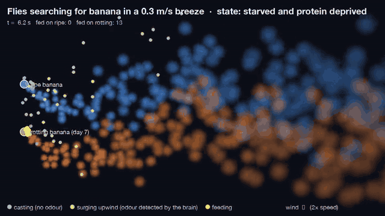
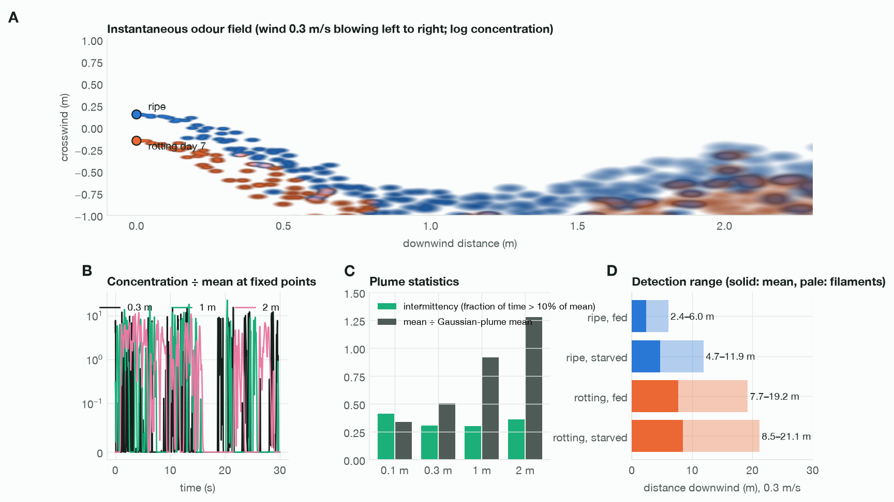
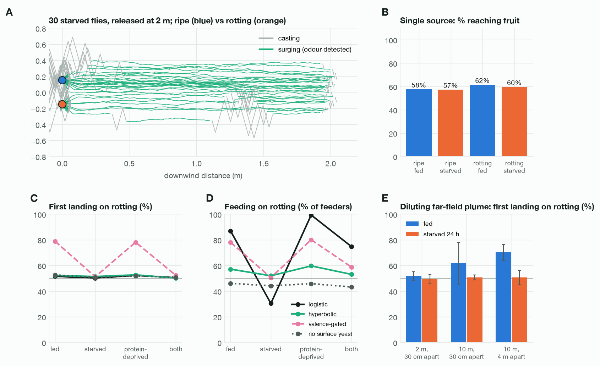

# Ripe or rotting

### Hunger, yeast and distance decide which banana a simulated fruit fly chooses

**Charbel Kassab** · charbel@kassab.org · preprint draft, September 2026

📄 **[Read the paper](https://charbelk.com/ripe-or-rotting/paper/)** · [PDF](https://charbelk.com/ripe-or-rotting/paper/ripe_or_rotting.pdf) · [project page](https://charbelk.com/ripe-or-rotting/) · [blog post](https://charbelk.com/blog/ripe-or-rotting) · [simulation code](simulation/) · [parameter sources](research/) · [raw results](results/)



*Flies deprived of food and protein search the odour plumes of a ripe (blue) and a rotting (orange) banana. Grey: casting; green: surging upwind after their simulated brain detects the odour; yellow: feeding.*

---

## The question

Fruit flies are famously drawn to fermenting fruit. Is that because rotting fruit **smells louder**, **tastes better**, or because
the fly's **hunger** (for energy or for protein) changes how it values both?

This project answers it with a simulation that starts from the chemistry of a real banana and ends with a fly's decision to fly
toward it and eat it, running every step through the complete wiring diagram of a male fruit fly's nervous system.

## Approach

| | Stage | What is simulated | Grounded in |
|---|---|---|---|
| 1 | **Fruit chemistry** | 14 days of ripening and yeast fermentation: sugars, ethanol, acetic acid, yeast biomass, fermentation by-products, pH | measured banana composition, yeast kinetics, fermenting-fruit surveys |
| 2 | **Emission** | how fast 11 volatiles and CO₂ leave the fruit, with temperature | Henry's-law constants, air diffusion coefficients |
| 3 | **Atmosphere** | a turbulent, intermittent odour plume in wind (filament model) | plume statistics |
| 4 | **Receptors** | 59 olfactory receptors → 52 neuron types; 6 taste neuron classes | DoOR 2.0 odorant responses, taste-neuron recordings |
| 5 | **Connectome** | the 165,122-neuron MaleCNS v1.0 connectome as a spiking network, in 4 hunger states | MaleCNS v1.0, whole-brain LIF model of Shiu et al. 2024 |
| 6 | **Reaction** | surge-and-cast flight, landing, feeding decision | wind-tunnel flight data, proboscis-extension data |

Every parameter has a source in [`research/`](research/); estimates are flagged as such.

## Findings

These are predictions of a model that passed four of its nine checks against real data. Each is testable.

1. **Fermentation mainly makes fruit easier to detect.** The simulated brain detects rotting banana at a tenth of the
   concentration, from about 8–19 m away versus 2–6 m for ripe banana in a light breeze, and further in warm weather.
2. **The long-range pull of rotting fruit should be strongest in well-fed flies.** Starvation sensitises the receptors that ripe
   fruit engages. From 10 m, fed flies landed first on rotting fruit 62–70% of the time; starved flies split evenly.
3. **Up close, odour intensity does not choose between fruits.** Within a few metres both plumes are above threshold in every
   filament, and first landings split about 50/50 in every state, wind and temperature.
4. **Rotting fruit tastes worse; the yeast on it tastes better.** Rotting pulp is 2–4× less acceptable to the brain (less
   sugar, more acid and ethanol). Surface yeast colonies more than compensate.
5. **What a fly eats depends on what it lacks.** Protein-deprived flies feed mostly on yeasty fruit; sugar-starved flies are the
   least drawn to it.
6. **The attraction of fermenting fruit is two mechanisms, not one:** far-reaching fermentation volatiles bias well-fed flies at
   a distance, and yeast taste biases protein-hungry flies on contact.

<p align="center"></p>

*Figure 3 of the paper. The odour a fly meets is intermittent; the brain detects rotting banana from about three times farther away.*

<p align="center"></p>

*Figure 6 of the paper. Stimulus to reaction: flight tracks, first landings and feeding choices by hunger state.*

## Validation

| Check | Result |
|---|---|
| Feeding neurons rise with sucrose concentration | pass |
| Starvation increases sugar acceptance | pass |
| Half-maximal proboscis extension in 1-day starved flies (held out): 238 mM vs 300 mM measured | pass |
| Different odours give different projection-neuron patterns | pass |
| Bitter suppresses sugar acceptance | by construction |
| Odour plume statistics | calibrated near field; far field too concentrated |
| Attraction to 108 odorants (cross-validated) | **fail** (r = 0.06) |
| Odour on one antenna lateralises steering output | **fail** |
| Starvation increases upwind flight success | **fail** |

The paper's limitations section covers the model's structural changes to the connectome, estimated chemistry parameters, the
male-only connectome and the behavioural rules that come from data rather than from the brain.

## Reproduce

Requires Python 3.11+, ~2 GB disk, ~8 GB RAM. Everything was run on an M-series Mac; the full pipeline takes several hours.
Run all commands from the repository root.

```sh
python3 -m venv .venv && .venv/bin/pip install -r requirements.txt

# data (not redistributed here)
./scripts/download_data.sh                              # MaleCNS v1.0 connectome tables, 1.1 GB
.venv/bin/python simulation/build_connectome.py         # -> data/brain.npz
./scripts/fetch_door.sh                                 # DoOR 2.0 odorant-response tables

# taste
.venv/bin/python simulation/feeding.py                  # taste validation
.venv/bin/python simulation/feeding_calibration.py      # proboscis-extension calibration + held-out test
.venv/bin/python simulation/run.py taste                # food x hunger-state taste grid

# smell and brain
.venv/bin/python simulation/olf_lookup.py               # whole-brain odour responses at 13 concentrations
.venv/bin/python simulation/probe_bilateral.py          # latency and left/right steering probe
.venv/bin/python simulation/valence.py                  # odour valence readout vs Knaden 2012

# behaviour
.venv/bin/python simulation/experiments.py              # plume calibration, single- and two-choice arenas, wind, temperature
.venv/bin/python simulation/experiments_far.py          # long-range tests, diluting plume, same-fruit control
.venv/bin/python simulation/detection_range.py

# paper
.venv/bin/python simulation/paper_figures.py            # paper/fig*.png
.venv/bin/python simulation/render_video.py starved_and_protein_deprived   # -> results/foraging_*.mp4
ffmpeg -i results/foraging_starved_and_protein_deprived.mp4 -vf scale=960:-2 -crf 30 -an paper/foraging.mp4
./paper/build_pdf.sh                                    # needs Chrome or Chromium
```

## Read more

- **Paper:** [charbelk.com/ripe-or-rotting/paper](https://charbelk.com/ripe-or-rotting/paper/) ([PDF](https://charbelk.com/ripe-or-rotting/paper/ripe_or_rotting.pdf), also in [`paper/`](paper/ripe_or_rotting.pdf))
- **Project page:** [charbelk.com/ripe-or-rotting](https://charbelk.com/ripe-or-rotting/)
- **Blog post, the story in plain language:** [Why do fruit flies end up on rotting fruit? I simulated one to find out.](https://charbelk.com/blog/ripe-or-rotting)

## Repository layout

```
paper/        the paper: PDF, web version, figures, video
simulation/   the model and every experiment in the paper
research/     literature parameters with a source for every number (chemistry, receptors, behaviour)
results/      raw outputs behind every number and figure in the paper
scripts/      downloads for third-party data
```

## Data and credits

- **Connectome:** MaleCNS v1.0, Google Research & HHMI Janelia FlyEM (2026), [male-cns.janelia.org](https://male-cns.janelia.org/), CC BY 4.0.
- **Odorant responses:** DoOR 2.0, Münch & Galizia (2016), *Sci Rep* 6:21841.
- **Base brain model:** Shiu et al. (2024), *Nature* 634:210.
- **Taste neuron identities:** FlyWire annotations, Schlegel et al. (2024), *Nature* 634:139.

The full reference list is in the paper.

## Citation

```bibtex
@techreport{kassab2026ripe,
  author = {Kassab, Charbel},
  title  = {Ripe or rotting: hunger, yeast and distance decide which banana a simulated fruit fly chooses},
  year   = {2026},
  note   = {Preprint draft},
  url    = {https://github.com/charbelkassab/ripe-or-rotting}
}
```

## License

Code: MIT. Paper, figures, video, parameter compilations and results: CC BY 4.0. See [LICENSE](LICENSE).
